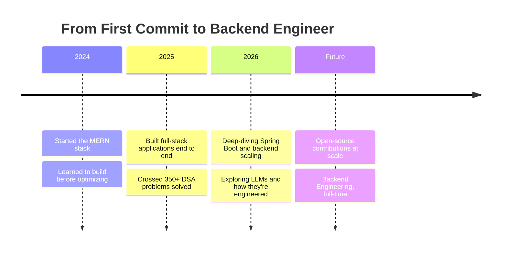

<!-- ============================================================= -->
<!-- HERO — the fold that decides whether someone keeps scrolling  -->
<!-- ============================================================= -->

<div align="center">


<br/>


</div>

<br/>

<!-- ============================================================= -->
<!-- SECTION 00 — TERMINAL IDENTITY                                 -->
<!-- ============================================================= -->
<!-- Terminal Section -->

<table width="100%">
<tr>
<td width="100%">

```bash
pravin@dev:~$ whoami
```
```yaml
name        : Pravin SK
location    : India
status      : Student → Backend Engineer (in progress)
stack       : Java · JavaScript · TypeScript
focus       : Backend systems, clean architecture, DSA
building    : Full-stack projects on the MERN + Spring Boot rails
mission     : Ship software that is boring in the best way — reliable, readable, fast
```

```bash
pravin@dev:~$ git log --author="Pravin SK" --oneline -3
```
```
a1e4f9c  fix: stopped over-engineering the auth layer
7c2b810  feat: learned that indexes matter (the hard way)
0f5d223  refactor: made past-me's code embarrassing
```

</td>
</tr>
</table>

<br/>

<!-- ============================================================= -->
<!-- SECTION 01 — ABOUT / PHILOSOPHY                                -->
<!-- ============================================================= -->
<!-- About Section -->

## `01` Field Notes

I write backend systems the way I solve DSA problems — look for the boring, correct answer before reaching for the clever one. Most of my time goes into Java and Spring Boot, with React and Node on the side so I can ship the whole product, not just the API.

I don't chase frameworks. I chase **understanding what the framework is hiding from me.**

<table width="100%">
<tr>
<td width="33%" valign="top">

**On Architecture**
<br/>
Readable beats clever.
A system you can explain in
one sentence is a system
you can maintain in five years.

</td>
<td width="33%" valign="top">

**On Learning**
<br/>
One problem a day, every day.
Depth compounds faster
than breadth — 350+ solved
problems taught me that.

</td>
<td width="33%" valign="top">

**On Shipping**
<br/>
Done and deployed beats
perfect and pending.
Ship it, measure it,
fix what actually breaks.

</td>
</tr>
</table>

<br/>

<!-- ============================================================= -->
<!-- SECTION 02 — CURRENT FOCUS / DASHBOARD                         -->
<!-- ============================================================= -->
<!-- Dashboard Section -->

## `02` Live Status

<table width="100%">
<tr>
<td width="50%" valign="top">

**Right now**

| | |
|---|---|
| 🧩 Learning | Spring Boot internals, LLM fundamentals |
| 🛠️ Building | MERN + Spring Boot side projects |
| 📖 Reading | System design case studies |
| 🎯 Practicing | Advanced DSA, daily |
| 💬 Ask me about | Java, REST APIs, JWT auth, MongoDB |

</td>
<td width="50%" valign="top">

**Vitals**

| | |
|---|---|
| ☕ Coffee level | ▰▰▰▰▰▰▰▱▱▱ 70% |
| 🌙 Late-night coding | ▰▰▰▰▰▰▰▰▱▱ 80% |
| 🐛 Bugs fixed today | Yes, probably one I wrote |
| 🔥 Current streak | Ask GitHub, not me |
| 🧠 Mental context switches | Java → JS → Java |

</td>
</tr>
</table>

<br/>

<!-- ============================================================= -->
<!-- SECTION 03 — ROADMAP (experience substitute for a student)     -->
<!-- ============================================================= -->
<!-- Roadmap Section -->

## `03` The Roadmap



<br/>

<!-- ============================================================= -->
<!-- SECTION 04 — TECH STACK                                        -->
<!-- ============================================================= -->
<!-- Tech Stack Section -->

## `04` Toolchain

<table width="100%">
<tr>
<td valign="top" width="25%">

**Languages**

<br/><br/>
`Java` — Advanced
`JavaScript` — Advanced
`TypeScript` — Intermediate

</td>
<td valign="top" width="25%">

**Frontend**

<br/><br/>
React · HTML · CSS
TailwindCSS

</td>
<td valign="top" width="25%">

**Backend**

<br/><br/>
Node.js · Express
Spring Boot · REST · JWT

</td>
<td valign="top" width="25%">

**Data & Tools**

<br/><br/>
MongoDB · MySQL · SQLite
Git · Postman · VS Code
IntelliJ · Vercel · Render

</td>
</tr>
</table>

<br/>

<!-- ============================================================= -->
<!-- SECTION 05 — GITHUB METRICS                                    -->
<!-- ============================================================= -->
<!-- Stats Section -->

## `05` The Numbers

<div align="center">

<!-- Note: the official github-readme-stats.vercel.app instance has been intermittently
     returning 503 DEPLOYMENT_PAUSED since early 2026. Using a community mirror below
     until it stabilizes. If it ever breaks again, self-host your own instance:
     https://github.com/anuraghazra/github-readme-stats#deploy-on-your-own -->


<br/>


<br/><br/>


</div>

<details>
<summary><b>Contribution snake</b></summary>
<br/>

<picture>
  <source media="(prefers-color-scheme: dark)" srcset="https://raw.githubusercontent.com/Pravin1821/Pravin1821/output/github-contribution-grid-snake-dark.svg">
  <source media="(prefers-color-scheme: light)" srcset="https://raw.githubusercontent.com/Pravin1821/Pravin1821/output/github-contribution-grid-snake.svg">
  
</picture>

<br/>

> Auto-generated via a scheduled GitHub Action (workflow file provided separately as `snake.yml`). It watches your contribution graph and publishes the animated SVG to an `output` branch, which the image above pulls from.

</details>

<br/>

<!-- ============================================================= -->
<!-- SECTION 06 — DEVELOPER DNA                                     -->
<!-- ============================================================= -->
<!-- Developer DNA Section -->

## `06` Developer DNA

<table width="100%">
<tr>
<td align="center" width="14%">🧬<br/><sub><b>Daily DSA<br/>Solver</b></sub></td>
<td align="center" width="14%">☕<br/><sub><b>Java-First<br/>Developer</b></sub></td>
<td align="center" width="14%">🔧<br/><sub><b>Backend<br/>Focused</b></sub></td>
<td align="center" width="14%">📡<br/><sub><b>Building<br/>in Public</b></sub></td>
<td align="center" width="14%">📚<br/><sub><b>Always<br/>Learning</b></sub></td>
<td align="center" width="14%">🧹<br/><sub><b>Clean Code<br/>Advocate</b></sub></td>
<td align="center" width="14%">🧩<br/><sub><b>Problem<br/>Solver</b></sub></td>
</tr>
</table>

<br/>

<!-- ============================================================= -->
<!-- SECTION 07 — FEATURED PROJECTS                                 -->
<!-- ============================================================= -->
<!-- Projects Section -->

## `07` Featured Work

> Replace these cards with your best repositories — pin them via `github.com/Pravin1821?tab=repositories`, then swap the `repo=` parameter below for each one.

<div align="center">

<a href="https://github.com/Pravin1821/REPO_NAME_1"></a>
<a href="https://github.com/Pravin1821/REPO_NAME_2"></a>

</div>

<br/>

<!-- ============================================================= -->
<!-- SECTION 08 — CODING PROFILES                                   -->
<!-- ============================================================= -->
<!-- Profiles Section -->

## `08` Find Me Elsewhere

<div align="center">

<a href="https://leetcode.com/u/Pravin_SK/"></a>
<a href="https://www.linkedin.com/in/pravin-sasikumar-176070297/"></a>
<a href="https://pravin-portfolio-beta.vercel.app/"></a>
<a href="mailto:pravincriss21@gmail.com"></a>

</div>

<br/>

<!-- ============================================================= -->
<!-- SECTION 09 — NOW PLAYING                                       -->
<!-- ============================================================= -->
<!-- Spotify Section -->

## `09` Currently On Loop

> Powered by <a href="https://github.com/kittinan/spotify-github-profile">spotify-github-profile</a> — connect your own Spotify account to activate live playback below.

<div align="center">

</div>

<br/>

<!-- ============================================================= -->
<!-- SECTION 10 — QUOTE + JOKE                                      -->
<!-- ============================================================= -->
<!-- Quote Section -->

## `10` Rotating Thoughts

<div align="center">


<br/><br/>


</div>

<br/>

<!-- ============================================================= -->
<!-- SECTION 11 — CLOSING                                           -->
<!-- ============================================================= -->
<!-- Footer Section -->

<div align="center">


<br/><br/>

<sub>Every commit here is a small argument that the next feature can be built well. Thanks for reading this far — that's rarer than a clean merge.</sub>

<br/><br/>


</div>
